```{R, setup, include = F}
# devtools::install_github("dill/emoGG")
library(pacman)
p_load(
  broom, tidyverse,
  latex2exp, ggplot2, ggthemes, ggforce, viridis, extrafont, gridExtra,
  kableExtra, snakecase, janitor,
  data.table, dplyr, estimatr,
  lubridate, knitr, parallel,
  lfe,
  here, magrittr
)
# Define pink color
red_pink <- "#e64173"
turquoise <- "#20B2AA"
orange <- "#FFA500"
red <- "#fb6107"
blue <- "#2b59c3"
green <- "#8bb174"
grey_light <- "grey70"
grey_mid <- "grey50"
grey_dark <- "grey20"
purple <- "#6A5ACD"
slate <- "#314f4f"
# Dark slate grey: #314f4f
# Knitr options
opts_chunk$set(
  comment = "#>",
  fig.align = "center",
  fig.height = 7,
  fig.width = 10.5,
  warning = F,
  message = F
)
opts_chunk$set(dev = "svg")
options(device = function(file, width, height) {
  svg(tempfile(), width = width, height = height)
})
options(crayon.enabled = F)
options(knitr.table.format = "html")
# A blank theme for ggplot
theme_empty <- theme_bw() + theme(
  line = element_blank(),
  rect = element_blank(),
  strip.text = element_blank(),
  axis.text = element_blank(),
  plot.title = element_blank(),
  axis.title = element_blank(),
  plot.margin = structure(c(0, 0, -0.5, -1), unit = "lines", valid.unit = 3L, class = "unit"),
  legend.position = "none"
)
theme_simple <- theme_bw() + theme(
  line = element_blank(),
  panel.grid = element_blank(),
  rect = element_blank(),
  strip.text = element_blank(),
  axis.text.x = element_text(size = 18, family = "STIXGeneral"),
  axis.text.y = element_blank(),
  axis.ticks = element_blank(),
  plot.title = element_blank(),
  axis.title = element_blank(),
  # plot.margin = structure(c(0, 0, -1, -1), unit = "lines", valid.unit = 3L, class = "unit"),
  legend.position = "none"
)
theme_axes_math <- theme_void() + theme(
  text = element_text(family = "MathJax_Math"),
  axis.title = element_text(size = 22),
  axis.title.x = element_text(hjust = .95, margin = margin(0.15, 0, 0, 0, unit = "lines")),
  axis.title.y = element_text(vjust = .95, margin = margin(0, 0.15, 0, 0, unit = "lines")),
  axis.line = element_line(
    color = "grey70",
    size = 0.25,
    arrow = arrow(angle = 30, length = unit(0.15, "inches")
  )),
  plot.margin = structure(c(1, 0, 1, 0), unit = "lines", valid.unit = 3L, class = "unit"),
  legend.position = "none"
)
theme_axes_serif <- theme_void() + theme(
  text = element_text(family = "MathJax_Main"),
  axis.title = element_text(size = 22),
  axis.title.x = element_text(hjust = .95, margin = margin(0.15, 0, 0, 0, unit = "lines")),
  axis.title.y = element_text(vjust = .95, margin = margin(0, 0.15, 0, 0, unit = "lines")),
  axis.line = element_line(
    color = "grey70",
    size = 0.25,
    arrow = arrow(angle = 30, length = unit(0.15, "inches")
  )),
  plot.margin = structure(c(1, 0, 1, 0), unit = "lines", valid.unit = 3L, class = "unit"),
  legend.position = "none"
)
theme_axes <- theme_void() + theme(
  text = element_text(family = "Fira Sans Book"),
  axis.title = element_text(size = 18),
  axis.title.x = element_text(hjust = .95, margin = margin(0.15, 0, 0, 0, unit = "lines")),
  axis.title.y = element_text(vjust = .95, margin = margin(0, 0.15, 0, 0, unit = "lines")),
  axis.line = element_line(
    color = grey_light,
    size = 0.25,
    arrow = arrow(angle = 30, length = unit(0.15, "inches")
  )),
  plot.margin = structure(c(1, 0, 1, 0), unit = "lines", valid.unit = 3L, class = "unit"),
  legend.position = "none"
)
theme_set(theme_gray(base_size = 20))
# Column names for regression results
reg_columns <- c("Term", "Est.", "S.E.", "t stat.", "p-Value")
# Function for formatting p values
format_pvi <- function(pv) {
  return(ifelse(
    pv < 0.0001,
    "<0.0001",
    round(pv, 4) %>% format(scientific = F)
  ))
}
format_pv <- function(pvs) lapply(X = pvs, FUN = format_pvi) %>% unlist()
# Tidy regression results table
tidy_table <- function(x, terms, highlight_row = 1, highlight_color = "black", highlight_bold = T, digits = c(NA, 3, 3, 2, 5), title = NULL) {
  x %>%
    tidy() %>%
    select(1:5) %>%
    mutate(
      term = terms,
      p.value = p.value %>% format_pv()
    ) %>%
    kable(
      col.names = reg_columns,
      escape = F,
      digits = digits,
      caption = title
    ) %>%
    kable_styling(font_size = 20) %>%
    row_spec(1:nrow(tidy(x)), background = "white") %>%
    row_spec(highlight_row, bold = highlight_bold, color = highlight_color)
}
```

```{css, echo = F, eval = F}
@media print {
  .has-continuation {
    display: block !important;
  }
}
```

```{r xaringan-tile-view, echo=FALSE}
xaringanExtra::use_tile_view()
xaringanExtra::use_panelset()
xaringanExtra::use_clipboard()
xaringanExtra::use_extra_styles()
```


class: title-slide  
<div class="my-logo-right"></div>
<br>
<br>
<br>
 

# Introduction to Regression 

## Big Data Foundations

### .smallest[Dominique-L. Couturier, Cancer Research UK, University of Cambridge, 🇬🇧]
### .smallest[Stéphane Guerrier, Data Analytics Lab, University of Geneva, 🇨🇭]
### .smallest[Maria-Pia Victoria-Feser, Research Center for Statistics, University of Geneva, 🇨🇭]
### .smallest[Yuming Zhang, Data Analytics Lab, University of Geneva 🇨🇭]

<br>
<br>
```{R, out.width = "30%", echo = F}

```
.center[.tiny[License: [CC BY NC SA 4.0](https://creativecommons.org/licenses/by-nc-sa/4.0/)]]

---

class: inverse, middle, center

# Introduction

---

# What is statistics?

.pull-left[
.smaller[.hi-purple[Statistics] is a science that uses mathematics and computer science to deal with the collection, analysis, interpretation, and presentation of masses of numerical data. Informally, it is the .pink[science of learning from data].]
```{R, stat, out.width = "90%", echo = F}
include_graphics("pics/stat.jpeg")
```
.tiny[Source: [luminousmen](luminousmen.com)]
]

.pull-right[
.smaller[.hi-purple[Statistics] is a crucial part of our life. However, .pink[statistical methods are often consciously (or not) misused]. This can lead to contradictory studies and conclusions (as seen during the current COVID-19 pandemic).]

```{R, torture, out.width = "85%", echo = F}
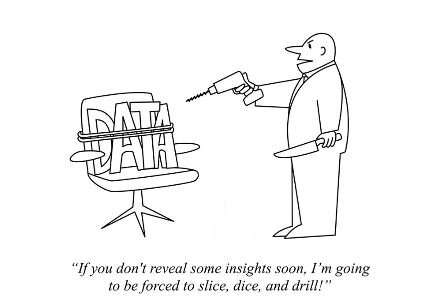
```

.tiny[Source: [Atoz Markets](https://atozmarkets.com/news/untold-reality-of-p-hacking-in-finance/)]
]

---

# How can statistics be useful?

.smaller[Statistics can be used (among others) to

1. .pink[Visualize data] (e.g. propagation of COVID-19 in different countries).
2. .pink[Understand and interpret data] (e.g. main causes of cancer). 
3. .pink[Assess the validity of a hypothesis] (e.g. is a drug working?).
4. .pink[Make predictions] (e.g. predicting unemployment or risk indices).]

.smaller[Learning more about statistics allows to 

1. Better understand arguments based on data.
2. Be able to apply critical thinking about statistics used as evidence.
3. Understand how statistical associations are used to evaluate claims (hypotheses) and assess causal connections.] 

.smaller[.purple[Understanding and knowing how to interpret statistical analyses is therefore becoming an increasingly vital skill.]]

---

# How to test a (scientific) hypothesis?

.center[
.purple["In god we trust, all others must bring data." <sup>.smallest[👋]</sup>]
]


- .smallest[To assess the .pink[validity of a (scientific) hypothesis], the scientific community (generally) agrees on a specific procedure.]
- .smallest[These hypotheses can be .pink[nearly anything], such as:]
  1. .smallest[Coffee consumption increases blood pressure. ]
  2. .smallest[Republican politicians are bad/good for the American Economy.]
  3. .smallest[A glass of red wine is as good as an hour at the gym.️]
- .smallest[This procedure involves the design of an experiment and then the collection of data to compute a metric, called .hi.purple[p-value], which evaluates the adequacy between the data and your original hypothesis.]
- .smallest[There is generally .pink[a specific threshold] (typically 5%), and if the p-value falls below this threshold we can claim that we have statistically significant result(s) validating our hypothesis.]

.footnote[.smallest[👋 From W. Edwards Deming]]

---

# Statistics vs Truth 🤥

- .smallest[.pink[Statistically significant results are not necessarily the truth], as there isn't a threshold (e.g. 5%) that separates real results from the false ones.]
- .smallest[This procedure simply provides us with one piece of a puzzle that should be considered in the context of other evidence.]

```{R, out.width = "50%", echo = F}
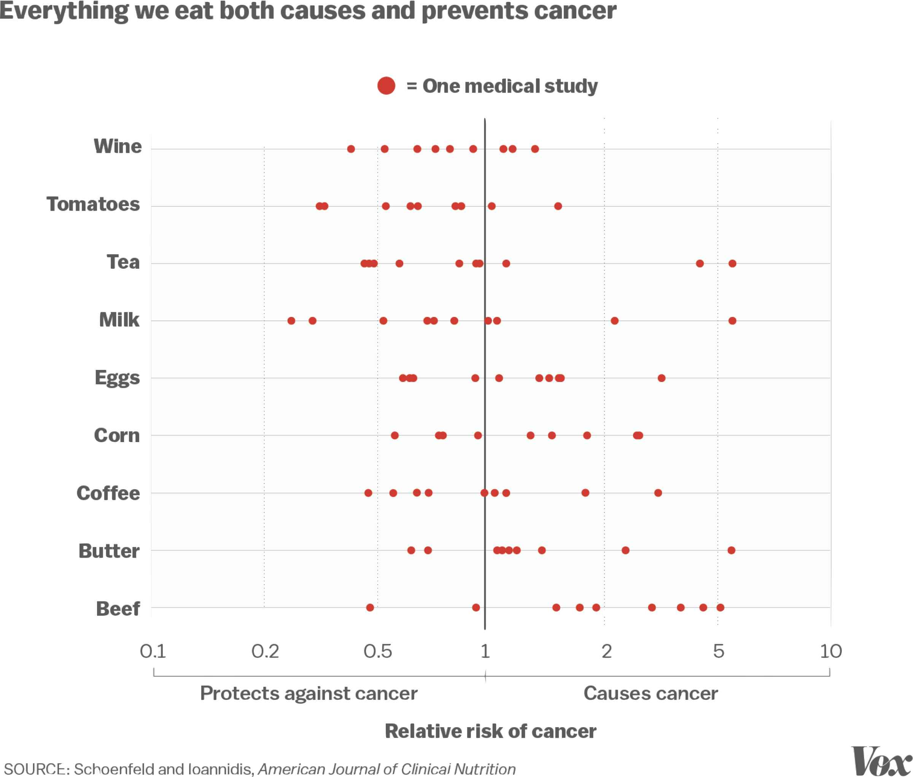
```

.footnote[.smallest[👋] Read the original article: "*This is why you shouldn't believe that exciting new medical study*" [here](https://www.vox.com/2015/3/23/8264355/research-study-hype).]

---

# How does it work?

.smallest[
- Statistical methods are based on several fundamental concepts, the most central of which is to consider the information available (in the form of data) resulting from a .pink[random process].
- As such, the data represent a .hi-purple[random sample] of a totally or conceptually accessible .hi-purple[population].
- Then, .pink[statistical inference] allows to infer the properties of a population based on the observed sample. This includes deriving estimates and testing hypotheses.
]

```{R, out.width = "45%", echo = F}
include_graphics("pics/sampling.png")
```
.tiny[Source: [luminousmen](luminousmen.com)]

---

# Hypothesis testing

- In general (scientific) hypotheses can be translated into a set of (non-overlapping idealized) statistical hypotheses:

$$H_0: \theta \color{#eb078e}{\in} \Theta_0 \  \text{ and } \ H_a: \theta \color{#eb078e}{\not\in} \Theta_0.$$

- In a hypothesis test, the statement being tested is called the .hi-purple[null hypothesis] $\color{#373895}{H_0}$. A hypothesis test is designed to assess the strength of the evidence against the null hypothesis.
- The .hi-purple[alternative hypothesis] $\color{#373895}{H_a}$ is the statement we hope or suspect to be true instead of $\color{#373895}{H_0}$.
- Each hypothesis excludes the other, so that one can exclude one in favor of the other using the data.
- .pink[Example:] a drug represses the progression of cancer

$$H_0: \mu_{\text{drug}} \color{#eb078e}{=} \mu_{\text{control}} \  \text{ and } \ H_a: \mu_{\text{drug}}  \color{#eb078e}{<} \mu_{\text{control}}.$$
---

# Hypothesis testing

```{R, out.width = "100%", echo = F}
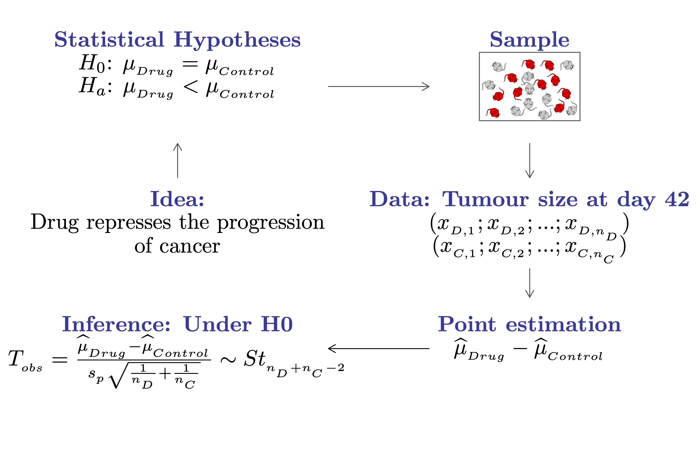
```

---

# Hypothesis testing


.smallest[
|                     | $H_0$ is true                               | $H_0$ is false                          |
| ------------------- |---------------------------------------------| ----------------------------------------|
| Can't reject $H_0$  | $\text{Correct decision (prob=}1-\alpha)$   | $\text{Type II error (prob=}1-\beta)$   |
| Reject $H_0$        | $\text{Type I error (prob}=\alpha)$         | $\text{Correct decision (prob=}\beta)$  |
]

- The .pink[type I error] corresponds to the probability of rejecting $H_0$ when $H_0$ is true (also called .pink[false positive]). The .purple[type II error] corresponds to the probability of not rejecting $H_0$ when $H_a$ is true (also called .purple[false negative]).
- A test is of .pink[significance level] $\color{#e64173}{\alpha}$ when the probability of making a type I error equals $\alpha$. Usually we consider $\alpha = 5\%$, however, this can vary depending on the context.
- A test is of .purple[power] $\color{#6A5ACD}{\beta}$ when the probability to make a type II error is $1-\beta.$ In other words, the power of a test is its probability of rejecting $H_0$ when $H_0$ is false (or the probability of accepting $H_a$ when $H_a$ is true).

---

# What are p-values?

- .smallest[The .hi-purple[p-value] is defined as the probability of observing a test statistic that is at least as extreme as actually observed, assuming that] $\small H_0$ .smallest[is true.]
- .smallest[Informally, .pink[a p-value can be understood as a measure of plausibility of the null hypothesis given the data]. Small p-value indicates strong evidence against] $\small H_0$.
- .smallest[When the p-value is small enough (i.e. smaller than the significance level] $\small \alpha$.smallest[), one says that the test based on the null and alternative hypotheses is .pink[significant] or that the null hypothesis is rejected in favor of the alternative. This is generally what we want because it "verifies" our (research) hypothesis.]
- .smallest[When the p-value is not small enough, with the available data, we cannot reject the null hypothesis so nothing can be concluded.] 🤔
- .smallest[The obtained p-value summarizes somehow the .pink[incompatibility between the data and the model] constructed under the set of assumptions.]

.center[
.smaller.purple["Absence of evidence is not evidence of absence."] <sup>.smallest[👋]</sup>]


.footnote[.smallest[👋] From the British Medical Journal.]

---

# How to understand p-values?

```{R, out.width = "45%", echo = F}
include_graphics("pics/p_value.png")
```

👋 .smallest[If you want to know more have a look [here](https://xkcd.com/1478/).]

---

# P-values may be controversial

.pink[P-values have been misused] many times because understanding what they mean is not intuitive!

<div align="center">
<iframe src="https://fivethirtyeight.abcnews.go.com/video/embed/56150342" width="675" height="380" scrolling="no" style="border:none;" allowfullscreen></iframe>
</div> 

👋 .smallest[If you want to know more have a look [here](https://fivethirtyeight.com/features/statisticians-found-one-thing-they-can-agree-on-its-time-to-stop-misusing-p-values/).]

---

class: inverse, middle, center

# Two-sample Location Tests

---

# .smaller[Two-sample location tests]

In practice, we often encounter problems where our goal is .pink[to compare the means (or locations) of two samples]. For example,
1. A scientist is interested in comparing the vaccine efficacy of the Pfizer-BioNTech and the Moderna vaccine.
2. A bank wants to know which of two proposed plans will most increase the use of its credit cards.
3. A psychologist wants to compare male and female college students' impression on a selected webpage.

We will discuss three .pink[two-sample location tests]:
1. .purple[Two independent sample Student's t-test]
2. .purple[Two independent sample Welch's t-test]
3. .purple[Two independent sample Mann-Whitney-Wilcoxon test]

---

# .smaller[Two independent sample Student's t-test]

This test considers the following assumed model for group .hi-purple2[A] and .hi-blue[B]

$$X_{i(g)} = \color{#eb078e}{\mu_{g}} + \varepsilon_{i(g)} = \mu + \color{#eb078e}{\delta_{g}} + \varepsilon_{i(g)},$$
where $g=A,B$, $i=1,...,n_{g}$, $\varepsilon_{i(g)} \overset{iid}{\sim} \mathcal{N}(0,\color{#eb078e}{\sigma^{2}})$ and $\sum n_{g}\delta_{g} =0$. 

📝 $\color{#6A5ACD}{n_A}$ $=$ sample size of group .hi-purple2[A], $\color{#6A5ACD}{\mu_{A} = \mu + \delta_A}$ $=$ population mean of group .hi-purple2[A], $\color{#06bcf1}{n_B}$ and $\color{#06bcf1}{\mu_{B} = \mu + \delta_B}$ are similarly defined for group .hi-blue[B].

Hypotheses:

$$H_0: \color{#6A5ACD}{\mu_A} - \color{#06bcf1}{\mu_B} \color{#eb078e}{=} \mu_0 \ \ \ \ \text{and} \ \ \ \ H_a: \color{#6A5ACD}{\mu_A} - \color{#06bcf1}{\mu_B} \ \big[ \color{#eb078e}{>} \text{ or } \color{#eb078e}{<} \text{ or } \color{#eb078e}{\neq} \big] \ \mu_0.$$

Test statistic's distribution under $H_0$:

$$\color{#b4b4b4}{T = \frac{(\overline{X}_{A}-\overline{X}_{B})-\mu_0}{s_{p}\sqrt{n_{A}^{-1}+n_{B}^{-1}}} \ {\underset{H_0}{\sim}} \ \text{Student}(n_{A}+n_{B}-2).}$$ 
---

# .smaller[Discussion - Student's t-test]

- R function: 

.center[
`t.test(x = ..., y = ..., alternative = ..., var.equal = TRUE)`.]

- This test strongly relies on the .pink[assumed absence of outliers]. If outliers appear to be present the Mann-Whitney-Wilcoxon test (see later) is (probably) a better option.
- For moderate and small sample sizes, the sample distribution should be at least .pink[approximately normal] with no strong skewness to ensure the reliability of the test.
- In practice, the assumption of equal variance is hard to verify so .hi.pink[we recommend to avoid this test in practice].

---

# .smaller[Two independent sample Welch's t-test]

This test considers the following assumed model for group .hi-purple2[A] and .hi-blue[B]

$$X_{i(g)} = \color{#eb078e}{\mu_{g}} + \varepsilon_{i(g)} = \mu + \color{#eb078e}{\delta_{g}} + \varepsilon_{i(g)},$$
where $g=A,B$, $i=1,...,n_{g}$, $\varepsilon_{i(g)} \overset{iid}{\sim} \mathcal{N}(0,\color{#eb078e}{\sigma^{2}_g})$ and $\sum n_{g}\delta_{g} =0$. 

📝 $\color{#6A5ACD}{n_A}$ $=$ sample size of group .hi-purple2[A], $\color{#6A5ACD}{\mu_{A} = \mu + \delta_A}$ $=$ population mean of group .hi-purple2[A], $\color{#06bcf1}{n_B}$ and $\color{#06bcf1}{\mu_{B} = \mu + \delta_B}$ are similarly defined for group .hi-blue[B].

Hypotheses: 

$$H_0: \color{#6A5ACD}{\mu_A} - \color{#06bcf1}{\mu_B} \color{#eb078e}{=} \mu_0 \ \ \ \ \text{and} \ \ \ \ H_a: \color{#6A5ACD}{\mu_A} - \color{#06bcf1}{\mu_B} \ \big[ \color{#eb078e}{>} \text{ or } \color{#eb078e}{<} \text{ or } \color{#eb078e}{\neq} \big] \ \mu_0.$$

Test statistic's distribution under $H_0$:

$$\color{#b4b4b4}{T = \frac{(\overline{X}_{A}-\overline{X}_{B})-\mu_0}{\sqrt{s^2_A/n_{A} + s^2_B/n_{B}}} \ {\underset{H_0}{\sim}} \ \text{Student}(df).}$$ 

---

# .smaller[Discussion - Welch's t-test]

- R function: 

.center[
`t.test(x = ..., y = ..., alternative = ...)`.]

- This test strongly relies on the .pink[assumed absence of outliers]. If outliers appear to be present the Mann-Whitney-Wilcoxon test (see later) is (probably) a better option.
- For moderate and small sample sizes, the sample distribution should be at least .pink[approximately normal] with no strong skewness to ensure the reliability of the test.
- This test does not require the variances of the two groups to be equal. If the variances of the two groups are the same (which is rather unlikely in practice), the Welch's t-test losses a little bit of power compared to the Student's t-test.
- The computation of $df$ (i.e. the degrees of freedom of the distribution under the null) is beyond the scope of this class.

---

# .smaller[Mann-Whitney-Wilcoxon test]

This test considers the following assumed model for group .hi-purple2[A] and .hi-blue[B]

$$X_{i(g)} = \color{#eb078e}{\theta_{g}} + \varepsilon_{i(g)} = \theta + \color{#eb078e}{\delta_{g}} + \varepsilon_{i(g)},$$
where $g=A,B$, $i=1,...,n_{g}$, $\varepsilon_{i(g)} \overset{iid}{\sim} (0,\color{#eb078e}{\sigma^{2}})$ and $\sum n_{g}\delta_{g} =0$. 

📝 $\color{#6A5ACD}{n_A}$ $=$ sample size of group .hi-purple2[A], $\color{#6A5ACD}{\theta_{A} = \theta + \delta_A}$ $=$ population .pink[location] of group .hi-purple2[A], $\color{#06bcf1}{n_B}$ and $\color{#06bcf1}{\theta_{B} = \theta + \delta_B}$ are similarly defined for group .hi-blue[B].

Hypotheses: $H_0: \color{#6A5ACD}{\theta_A} - \color{#06bcf1}{\theta_B} \color{#eb078e}{=} \theta_0 \ \ \ \ \text{and} \ \ \ \ H_a: \color{#6A5ACD}{\theta_A} - \color{#06bcf1}{\theta_B} \ \big[ \color{#eb078e}{>} \text{ or } \color{#eb078e}{<} \text{ or } \color{#eb078e}{\neq} \big] \ \theta_0.$

Test statistic's distribution under $H_0$:

$$\color{#b4b4b4}{Z = \frac{\sum_{i=1}^{n_{B}}R_{i(g)}-[n_{B}(n_{A}+n_{B}+1)/2]}{\sqrt{n_{A}n_{B}(n_{A}+n_{B}+1)/12}},}$$
.grey[where] $\color{#b4b4b4}{R_{i(g)}}$ .grey[denotes the global rank of the] $\color{#b4b4b4}{i}$.grey[-th observation of group] $\color{#b4b4b4}{g}$.grey[.]

---

# .smaller[Discussion - Mann-Whitney-Wilcoxon test]

- R function: `wilcox.test(x = ..., y = ..., alternative = ...)`.
- This test is ".pink[robust]" in the sense that (unlike the t-tests) it is not overly affected by outliers.
- For the Mann-Whitney-Wilcoxon test to be comparable to the t-tests (i.e. testing for the mean) we need to assume: (1) The distributions are symmetric, (2) the variances are the same. Then, we have $\color{#6A5ACD}{\theta_A = \mu_A}$ and $\color{#06bcf1}{\theta_B = \mu_B}$.
- Compared to the t-tests, the Mann-Whitney-Wilcoxon test is less powerful if their requirements (Gaussian and possibly same variances) are met.
- The distribution of this method under the null is complicated and can be obtained by different methods (e.g. exact, asymptotic normal, ...). The details are beyond the scope of this class.
 
---

# Comparing diets A and B 

.panelset[
.panel[.panel-name[Graph]
```{R, dietB, out.width = "80%", echo = F}
include_graphics("pics/dietAB.png")
```
]
.panel[.panel-name[Import]
```{r xaringan-extra-styles}
# Import data
diet = read.csv("data/diet.csv",row.names=1)

# Compute weight loss
diet$weight.loss = diet$initial.weight - diet$final.weight

# Select diet
posA = diet$diet.type=="A"
posB = diet$diet.type=="B"

# Variable of interest
dietA = diet$weight.loss[posA]
dietB = diet$weight.loss[posB]
```
]
.panel[.panel-name[Student]
```{r}
t.test(dietA, dietB, var.equal = TRUE)
```
]
.panel[.panel-name[Welch]
```{r}
t.test(dietA, dietB)
```
]
.panel[.panel-name[Wilcox]
```{r}
wilcox.test(dietA, dietB)
```
]
.panel[.panel-name[Results]
1. .purple[Define hypotheses:] $H_0: \mu_A = \mu_B$ and $H_a: \mu_A \color{#e64173}{\neq} \mu_B$.
2. .purple[Define] $\color{#373895}{\alpha}$: We consider $\alpha = 5\%$.
3. .purple[Compute p-value]: Welch's t-test appears suitable in this case, and therefore, we obtain: p-value =  $96.22 \%$ (see R output tab for details).
4. .purple[Conclusion:] We have p-value > $\alpha$ so we fail to reject the null hypothesis at the significance level of 5%.
]
]

---

class: inverse, middle, center

# Location Tests with Multiple Samples

---

# Problems with multiple samples

In practice, we often even encounter situations where we need to .pink[compare the means of more than 2 groups]. For example, we want to compare the weight loss efficacy of several diets, say diets .hi-purple2[A], .hi-blue[B], .hi-green[C]. Your theory could, for example, be the following: $0 < \color{#6A5ACD}{\mu_A} = \color{#06bcf1}{\mu_B} < \color{#8bb174}{\mu_C}$. A possible approach to evaluate its validity:

1. Show that $\color{#8bb174}{\mu_C}$ is greater than $\color{#6A5ACD}{\mu_A}$ and $\color{#06bcf1}{\mu_B}$ (i.e. Test 1:  $H_0$: $\color{#6A5ACD}{\mu_A} = \color{#8bb174}{\mu_C}$, $H_a$: $\color{#6A5ACD}{\mu_A} < \color{#8bb174}{\mu_C}$; Test 2: $H_0$: $\color{#06bcf1}{\mu_B} = \color{#8bb174}{\mu_C}$, $H_a$: $\color{#06bcf1}{\mu_B} < \color{#8bb174}{\mu_C}$). Here we hope to reject $H_0$ in both cases.
2. Show that $\color{#6A5ACD}{\mu_A}$ and $\color{#06bcf1}{\mu_B}$ are greater than 0 (i.e. Test 3:  $H_0$: $\color{#6A5ACD}{\mu_A} = 0$, $H_a$: $\color{#6A5ACD}{\mu_A} > 0$; Test 4: $H_0$: $\color{#06bcf1}{\mu_B} = 0$, $H_a$: $\color{#06bcf1}{\mu_B} >0$). Here we also hope to reject $H_0$ in both cases.
3. Compare $\color{#6A5ACD}{\mu_A}$ and $\color{#06bcf1}{\mu_B}$ (i.e. Test 5: $H_0$: $\color{#6A5ACD}{\mu_A} = \color{#06bcf1}{\mu_B}$, $H_a$: $\color{#6A5ACD}{\mu_A} \neq \color{#06bcf1}{\mu_B}$). Here we hope not to reject $H_0$. ⚠️ This does not imply that $\color{#6A5ACD}{\mu_A} = \color{#06bcf1}{\mu_B}$ is true but at least the result would not contradict our theory.

---

# .smaller[Is there a problem in doing many tests?]

.purple[Are jelly beans causing acne? Maybe... but why only green ones?] 🤨 

```{R, green, out.width = "45%", echo = F}
include_graphics("pics/green.png")
```
.tiny[Source: [xkcd](https://xkcd.com/882/)]
---

# .smaller[Are jelly beans causing acne?]

<br>
```{R, green1, out.width = "85%", echo = F}
include_graphics("pics/green1.png")
```
.tiny[Source: [xkcd](https://xkcd.com/882/)]

---

# .smaller[Maybe a specific color?]

<br>
```{R, green2, out.width = "76%", echo = F}
include_graphics("pics/green2.png")
```
.tiny[Source: [xkcd](https://xkcd.com/882/)]

---

# .smaller[Maybe a specific color?]

<br>
```{R, green3, out.width = "75%", echo = F}
include_graphics("pics/green3.png")
```
.tiny[Source: [xkcd](https://xkcd.com/882/)]

---

# .smaller[And finally...]

```{R, greenagain, out.width = "45%", echo = F}
include_graphics("pics/green.png")
```
.tiny[Source: [xkcd](https://xkcd.com/882/)]

👋 .smallest[If you want to know more about this comics have a look [here](https://www.explainxkcd.com/wiki/index.php/882:_Significant).]

---

# .smaller[Multiple testing can be dangerous!]

- Remember that a p-value is .purple2[random] as its value depends on the data.
- If multiple hypotheses are tested, the chance of observing a rare event increases, and therefore, the chance to incorrectly reject a null hypothesis (i.e. making a Type I error) increases.
- For example, if we consider $k$ (independent) tests (whose null hypotheses are all correct), we have

$$\begin{align}
\alpha_k &= \Pr(\text{reject } H_0 \text{ at least once}) \\
&= 1 - \Pr(\text{not reject } H_0 \text{ test 1}) \times \ldots \times \Pr(\text{not reject } H_0 \text{ test k})\\
&= 1 - (1-\alpha) \times \ldots \times (1-\alpha) = 1 - (1-\alpha)^k
\end{align}$$

- Therefore, $\alpha_k$ increases rapidly with $k$ (e.g. $\alpha_1 = 0.05$, $\alpha_2 \approx 0.098$, $\alpha_{10} \approx 0.4013$, $\alpha_{100} \approx 0.9941$).
- Hence .pink[performing multiple tests, with the same or different data, is dangerous] ⚠️ (but very common! 😟) as it can leads to significant results, when actually there are none!

---

# .smaller[Possible solutions]

Suppose that we are interested in making $k$ tests and that we want the probability of rejecting the null at least once (assuming the null hypotheses to be correct for all tests) $\alpha_k$ to be equal to $\alpha$ (typically 5%). Instead of using $\alpha$ for the individual tests we will use $\alpha_c$ (i.e. a corrected $\alpha$). Then, for $k$ (potentially .purple2[dependent]) tests we have

$$\begin{align}
\alpha_k &= \alpha = \Pr(\text{reject } H_0 \text{ at least once}) \\
&= \Pr(\text{reject } H_0 \text{ test 1} \; \cup \; \ldots \; \cup \; \text{reject } H_0 \text{ test k})\\
&\color{#eb078e}{\leq} \sum_{i = 1}^k \Pr(\text{reject } H_0 \text{ test i}) = \alpha_c \times k.
\end{align}$$

Solving for $\alpha_c$ we obtain: $\color{#6A5ACD}{\alpha_c = \alpha/k}$, which is called .pink[Bonferroni correction]. By making use of the .pink[Boole's inequality], this approach does not require any assumptions about dependence among the tests or about how many of the null hypotheses are true.

---

# .smaller[Possible solutions]

The Bonferroni correction can be conservative if there are a large number of tests, as it comes at the cost of reducing the power of the individual tests (e.g. if $\alpha = 5\%$ and $k = 20$, we get $\alpha_c = 0.05/20 = 0.25\%$). There exists a (slightly) "tighter" bound for $\alpha_k$, which is given by

$$\alpha_k = \Pr(\text{reject } H_0 \text{ at least once}) \color{#eb078e}{\leq} 1 - (1 - \alpha_c)^k.$$
Solving for $\alpha_c$ we obtain: $\color{#6A5ACD}{\alpha_c = 1 - (1 - \alpha)^{1/k}}$, which is called .pink[Dunn–Šidák correction]. This correction is (slightly) less stringent than the Bonferroni correction (since $1 - (1 - \alpha)^{1/k} > \alpha/k$ for $k \geq 2$).

There exist many other alternative methods for multiple testing corrections. It is important to mention that when $k$ is large (say $>$ 100) the Bonferroni and Dunn–Šidák corrections become inapplicable and methods based on the idea of .pink[False Discovery Rate] should be preferred. However, these recent methods are beyond the scope of this class.

---

# .smaller[Multiple-sample location tests]

To compare several means of different populations, a standard approach is to start our analysis by using the .pink[multiple-sample location tests]. More precisely, we proceed our analysis with the following steps:

  - .purple2[Step 1:] We first perform the multiple-sample location tests, where the null hypothesis states that all the locations are the same. If we cannot reject the null hypothesis, we stop our analysis here. Otherwise, we move on to Step 2.
  - .purple2[Step 2:] We compare the groups mutually (using $\alpha_c$) with two-sample location tests in order to verify our hypothesis.
  
We will discuss three .pink[multiple-sample location tests]:

 1. .purple2[Fisher's one-way ANalysis Of VAriance (ANOVA)]
 2. .purple2[Welch's one-way ANOVA]
 3. .purple2[Kruskal-Wallis test]

---

# Fisher's one-way ANOVA

.smallest[This test considers the following assumed model for G groups]
$$\small X_{i(g)} = \color{#eb078e}{\mu_{g}} + \varepsilon_{i(g)} = \mu + \color{#eb078e}{\delta_{g}} + \varepsilon_{i(g)},$$
.smallest[where] $\small g=1,\ldots, G$, $i=1,...,n_{g}$, $\small \varepsilon_{i(g)} \overset{iid}{\sim} \mathcal{N}(0,\color{#eb078e}{\sigma^{2}})$ .smallest[and] $\small \sum n_{g}\delta_{g}=0$. 

📝 $\small n_i =$ .smallest[sample size of group] $\small i$, $\small \mu_i = \mu + \delta_i =$ .smallest[population mean of group] $\small i$, $\small i=1,\ldots, G$.

.smallest[Hypotheses:]
$$\small H_0: \color{#6A5ACD}{\mu_1} \color{#eb078e}{=} \color{#06bcf1}{\mu_2} \color{#eb078e}{=} \ldots \color{#eb078e}{=} \color{#8bb174}{\mu_G} \ \ \ \ \text{and} \ \ \ \ H_a: \mu_i \color{#eb078e}{\neq} \mu_j \ \ \text{for at least one pair of} \ \ (i,j).$$

.smallest[Test statistic's distribution under] $\small H_0$:

$\small \color{#b4b4b4}{F = \frac{N s^2_{\overline{X}}}{s_p^2} \ {\underset{H_0}{\sim}} \ \text{Fisher}(G-1, N-G),}$
.smallest[.grey[where]] $\small \color{#b4b4b4}{s^2_{\overline{X}} = \frac{1}{G-1} \sum_{g=1}^G \frac{n_g}{N} (\overline{X}_g - \overline{X})^2}$.smallest[.grey[,]] $\small \color{#b4b4b4}{s_p^2 = \frac{1}{N-G} \sum_{g=1}^G (n_g-1)s_g^2}$.smallest[.grey[,]] $\small \color{#b4b4b4}{N = \sum_{g=1}^G n_g}$.smallest[.grey[, and]] $\small \color{#b4b4b4}{\overline{X} = \frac{1}{N} \sum_{g=1}^G n_g \overline{X}_g}$.smallest[.grey[.]]

---

# Discussion - Fisher's one-way ANOVA

- R function: 

.center[
`aov(response ~ groups, data = mydata)`.]

- This test strongly relies on the .pink[assumed absence of outliers]. If outliers appear to be present the Kruskal-Wallis test (see later) is (probably) a better option.
- For moderate and small sample sizes, the sample distribution should be at least .pink[approximately normal] with no strong skewness to ensure the reliability of the test.
- In practice, the assumption of equal variance is hard to verify so .hi.pink[we recommend to avoid this test in practice].

---

# Welch's one-way ANOVA

.smallest[This test considers the following assumed model for G groups]
$$\small X_{i(g)} = \color{#eb078e}{\mu_{g}} + \varepsilon_{i(g)} = \mu + \color{#eb078e}{\delta_{g}} + \varepsilon_{i(g)},$$
.smallest[where] $\small g=1,\ldots, G$, $i=1,...,n_{g}$, $\small \varepsilon_{i(g)} \overset{iid}{\sim} \mathcal{N}(0,\color{#eb078e}{\sigma_g^{2}})$ .smallest[and] $\small \sum n_{g}\delta_{g}=0$. 

.smallest[Hypotheses:]
$$\small H_0: \color{#6A5ACD}{\mu_1} \color{#eb078e}{=} \color{#06bcf1}{\mu_2} \color{#eb078e}{=} \ldots \color{#eb078e}{=} \color{#8bb174}{\mu_G} \ \ \ \ \text{and} \ \ \ \ H_a: \mu_i \color{#eb078e}{\neq} \mu_j \ \ \text{for at least one pair of} \ \ (i,j).$$

.smallest[Test statistic's distribution under] $\small H_0$:
$$\small \color{#b4b4b4}{F^* = \frac{s^{*^2}_{\overline{X}}}{1+\frac{2(G-2)}{3\Delta}} \ {\underset{H_0}{\sim}} \ \text{Fisher}(G-1, \Delta),}$$
.smallest[.grey[where]] $\small \color{#b4b4b4}{s^{*^2}_{\overline{X}} = \frac{1}{G-1} \sum_{g=1}^G w_g (\overline{X}_g - \overline{X}^*)^2}$.smallest[.grey[,]] $\small \color{#b4b4b4}{\Delta = [\frac{3}{G^2-1} \sum_{g=1}^G \frac{1}{n_g} (1-\frac{w_g}{\sum_{g=1}^G w_g})]^{-1}}$.smallest[.grey[,]] $\small \color{#b4b4b4}{w_g = \frac{n_g}{s_g^2}}$.smallest[.grey[, and]] $\small \color{#b4b4b4}{\overline{X}^* = \sum_{g=1}^G \frac{w_g\overline{X}_g}{\sum_{g=1}^G w_g}}$.smallest[.grey[.]]

---

# Discussion - Welch's one-way ANOVA

- R function: 

.center[
`oneway.test(response ~ groups, data = mydata)`.]

- This test strongly relies on the .pink[assumed absence of outliers]. If outliers appear to be present the Kruskal-Wallis test (see later) is (probably) a better option.
- For moderate and small sample sizes, the sample distribution should be at least .pink[approximately normal] with no strong skewness to ensure the reliability of the test.
- This test does not require the variances of the groups to be equal. If the variances of all the groups are the same (which is rather unlikely in practice), the Welch's one-way ANOVA losses a little bit of power compared to the Fisher's one-way ANOVA.

---

# Kruskal-Wallis test

.smallest[This test considers the following assumed model for G groups]
$$\small X_{i(g)} = \color{#eb078e}{\theta_{g}} + \varepsilon_{i(g)} = \theta + \color{#eb078e}{\delta_{g}} + \varepsilon_{i(g)},$$
.smallest[where] $\small g=1,\ldots, G$, $i=1,...,n_{g}$, $\small \varepsilon_{i(g)} \overset{iid}{\sim} \mathcal{N}(0,\color{#eb078e}{\sigma^{2}})$ .smallest[and] $\small \sum n_{g}\delta_{g}=0$. 

📝 $\small n_i =$ .smallest[sample size of group] $\small i$, $\small \theta_i = \theta + \delta_i =$ .smallest[population .pink[location] of group] $\small i$, $\small i=1,\ldots, G$.

.smallest[Hypotheses:]
$$\small H_0: \color{#6A5ACD}{\theta_1} \color{#eb078e}{=} \color{#06bcf1}{\theta_2} \color{#eb078e}{=} \ldots \color{#eb078e}{=} \color{#8bb174}{\theta_G} \ \ \ \ \text{and} \ \ \ \ H_a: \theta_i \color{#eb078e}{\neq} \theta_j \ \ \text{for at least one pair of} \ \ (i,j).$$

.smallest[Test statistic's distribution under] $\small H_0$: $\small \color{#b4b4b4}{H = \frac{\frac{12}{N(N+1)} \sum_{g=1}^G \frac{\overline{R}_g}{n_g}-3(N-1)}{1-\frac{\sum_{v=1}^V{t_v^3-t_v}}{N^3-N}} \ {\underset{H_0}{\sim}} \mathcal{X}(G-1)}$.smallest[.grey[, where]] $\small \color{#b4b4b4}{\overline{R}_g = \frac{1}{n_g} \sum_{i=1}^{n_g} R_{i(g)}}$ .smallest[.grey[with]] $\small \color{#b4b4b4}{R_{i(g)}}$ .smallest[.grey[denoting the global rank of the]] $\small \color{#b4b4b4}{i^{th}}$ .smallest[.grey[observation of group]] $\small \color{#b4b4b4}{g}$.smallest[.grey[,]] $\small \color{#b4b4b4}{V}$ .smallest[.grey[is the number of different values/levels in]] $\small \color{#b4b4b4}{X}$ .smallest[.grey[and]] $\small \color{#b4b4b4}{t_v}$ .smallest[.grey[denotes the number of times a given value/level occurred in]] $\small \color{#b4b4b4}{X}$.smallest[.grey[.]]

---

# Discussion - Kruskal-Wallis test

- R function: 

.center[
`kruskal.test(response ~ groups, data = mydata)`.]

- This test is ".pink[robust]" in the sense that (unlike the one-way ANOVA) it is not overly affected by outliers.
- For the Kruskal-Wallis test to be comparable to the one-way ANOVAs (i.e. testing for the mean) we need to assume: (1) The distributions are symmetric, (2) the variances are the same. Then, we have $\color{#eb078e}{\theta_i = \mu_i, i=1,\ldots,G}$.
- Compared to the one-way ANOVA, the Kruskal-Wallis test is less powerful if their requirements (Gaussian and possibly same variances) are met.

---

# .smaller[Exercise: Comparing diets A, B and C]

.panelset[
.panel[.panel-name[Graph]
```{R, dietABC, out.width = "80%", echo = F}
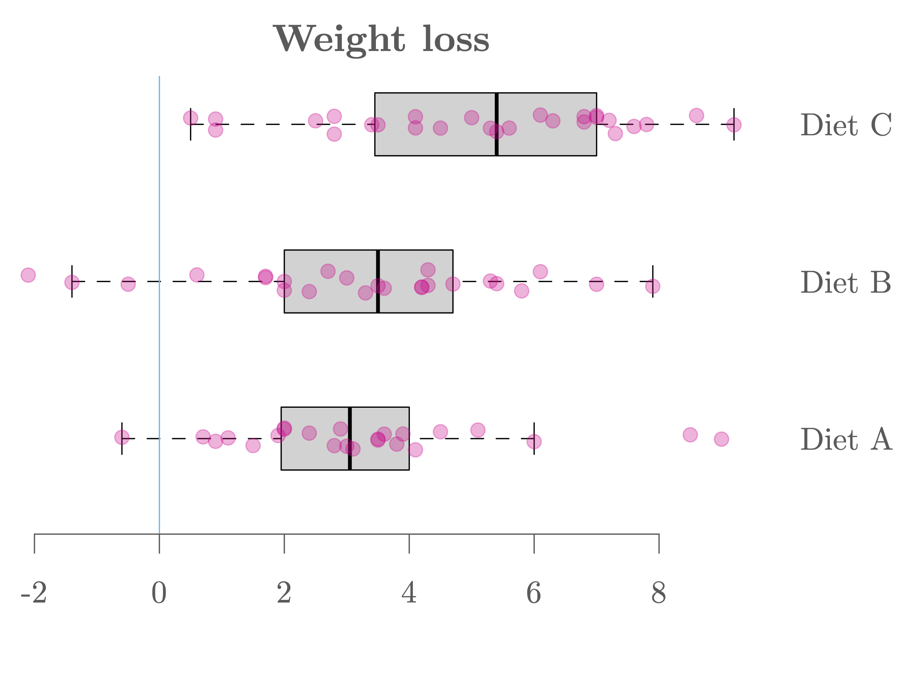
```
]
.panel[.panel-name[Import]
```{r}
# Import data and compute weight loss
diet = read.csv("data/diet.csv",row.names=1)
diet$weight.loss = diet$initial.weight - diet$final.weight

# Variable of interest
dietA = diet$weight.loss[diet$diet.type=="A"]
dietB = diet$weight.loss[diet$diet.type=="B"]
dietC = diet$weight.loss[diet$diet.type=="C"]

# Create data frame
dat = data.frame(response = c(dietA, dietB, dietC), 
                 groups = c(rep("A", length(dietA)), 
                            rep("B", length(dietB)), 
                            rep("C", length(dietC))))
```
]
]

---

# .smaller[Solution: Comparing diets A, B and C]

.panelset[
.panel[.panel-name[Step1: ANOVA]
To compare diets A, B, and C, we first test if there's any difference among these 3 diets by considering a Welch's one-way ANOVA.

1. .purple[Define hypotheses:] $$H_0: \mu_A = \mu_B = \mu_C \ \ \ \ \text{and} \ \ \ \ H_a: H_0 \text{ is false}.$$
2. .purple[Define] $\color{#6A5ACD}{\alpha}$: We consider $\alpha = 5\%$.
3. .purple[Compute p-value]: p-value = $0.85\%$ (see R code tab for details).
4. .purple[Conclusion:] We have p-value < $\alpha$ so we reject the null and accept the alternative at the significance level of $5\%$.
]
.panel[.panel-name[R Code]
```{r}
(anova_res = oneway.test(response ~ groups, data = dat))
```
]
.panel[.panel-name[Step2: T-tests]
1. .smallest[.purple[Define hypotheses:]] $$\small H_0: \mu_A = \mu_B \ \ \ \ \text{and} \ \ \ \ H_a: \mu_A < \mu_B. \\ \small H_0: \mu_A = \mu_C \ \ \ \ \text{and} \ \ \ \ H_a: \mu_A < \mu_C. \\ \small H_0: \mu_B = \mu_C \ \ \ \ \text{and} \ \ \ \ H_a: \mu_B < \mu_C.$$
2. .smallest[.purple[Define significance level]: We consider] $\small \alpha/3 = 5\%/3 \approx 1.67\%$ .smallest[for each pair of hypotheses.]
3. .smallest[.purple[Compute p-values]:] $\small p_{AB} \approx 51.89\%$ .smallest[for the t-test between diets A and B;] $\small p_{AC} \approx 0.32\%$ .smallest[for the t-test between diets A and C;] $\small p_{BC} \approx 0.38\%$ .smallest[for the t-test between diets B and C (see R code tab for details).]
4. .smallest[.purple[Conclusion:] Since] $\small p_{AB} > 1.67\%$.smallest[,] $\small p_{AC} < 1.67\%$ .smallest[and] $\small p_{BC} < 1.67\%$.smallest[, we fail to reject] $\small H_0: \mu_A = \mu_B$ .smallest[and reject both] $\small H_0: \mu_A = \mu_C$ .smallest[and] $\small H_0: \mu_B = \mu_C$ .smallest[at the significance level of] $\small 5\%$.smallest[.]
]
.panel[.panel-name[R Code]
```{r, eval=FALSE}
t.test(dietA, dietB, alternative = "less")
t.test(dietA, dietC, alternative = "less")
t.test(dietB, dietC, alternative = "less")
```
]

]

---

class: inverse, middle, center

# Linear Regression

---

# .smallest[Motivating Example: Reading Ability]

.panelset[
.panel[.panel-name[Problem]
An educator believes that .purple2[new directed reading activities] in the classroom can help elementary school students (6-12 years old) improve their reading ability. She arranged a pilot study where some students (chosen at random) of age 6 start to take part in these activities .hi-purple2[(treatment group)], meanwhile other students continue with the .pink[classical curriculum] .hi-pink[(control group)]. The educator wishes to evaluate the effectiveness of these activities so all students are given a Degree of Reading Power (DRP) test, which assesses their reading ability. 

.pink[Can we conclude that these new directed reading activities can help elementary school students improve their reading ability?]
]
.panel[.panel-name[Data]

```{r}
dat = read.csv("data/reading.csv")
control = dat$score[dat$group == "Control"]
head(control)
treatment = dat$score[dat$group == "Treatment"]
head(treatment)
```

]
.panel[.panel-name[Graph]

```{R, readingboxplot, out.width = "80%", echo = F}
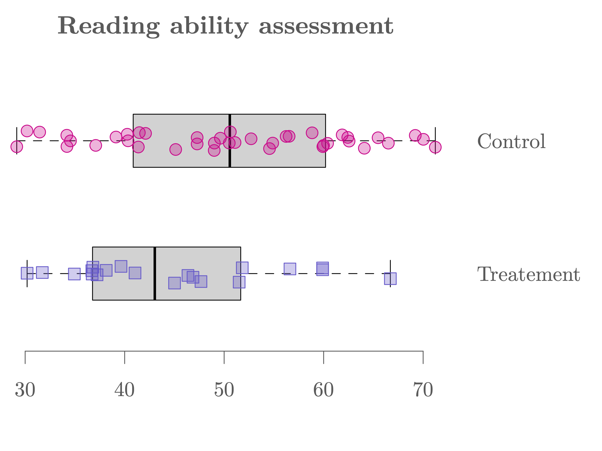
```

]
.panel[.panel-name[Test]
1. .purple[Define hypotheses:] $H_0: \mu_T = \mu_C$ and $H_a: \mu_T > \mu_C$.
2. .purple[Define] $\color{#6A5ACD}{\alpha}$: We consider $\alpha = 5\%$.
3. .purple[Compute p-value]: p-value = $97.12\%$ (see R code tab for details).
4. .purple[Conclusion:] We have p-value > $\alpha$ so we cannot reject the null hypothesis at the significance level of 5%. 

.hi-pink[Remark:] Notice that the p-value for the test with opposite hypotheses is actually $100\%-97.12\%=2.88\% < \alpha$ (Why? 🤔). So we conclude, at the significance level of 5%, that the classical curriculum without these new directed reading activities actually improve students' reading ability more compared to the curriculum with these activities. 😬
]
.panel[.panel-name[`R` Code ]
```{r}
t.test(treatment, control, alternative = "greater")
```
]
]

---

# .smaller[Is our analysis comprehensive?]

The educator points out that only students of 6-8 years old have participated in the new directed reading activities. In other words, in the sample she collected, the students in the treatment group are only of age 6 to 8, whereas the students in the control group vary from 6 to 12 years old. .pink[Is age a potential explanation to the difference we observe among the students' reading ability?]

To make sure that the analysis is reliable, she includes the age information of the students, which can be accessed as follows:

```{r}
treatment_age = dat$age[dat$group == "Treatment"]
control_age   = dat$age[dat$group == "Control"]
```

---

# .smaller[Should age be taken into account?]

```{R, readingpoint, out.width = "90%", echo = F}
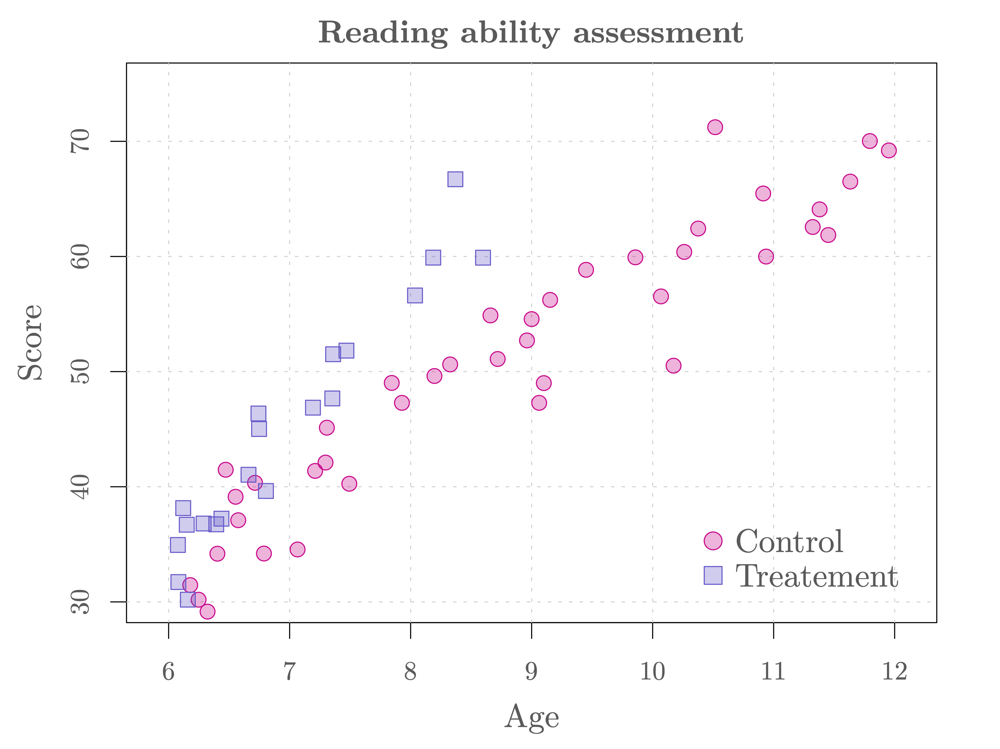
```

---

# .smaller[Regression analysis]

- Regression analysis corresponds to a set of statistical methods for estimating the .pink[relationships] between a response variable $Y$ of primary interest (also called the *outcome variable*) and some explanatory variables $X_1, \ldots, X_p$ (also called *covariates*, *regressors*, *features* or *predictors*).
- The relationship between the response variable $Y$ and the covariates is not .purple2[deterministic] and we model the .purple2[conditional expected value] (i.e. $\mathbb{E}[Y | X_1, \ldots, X_p]$).
- Therefore, we consider the following (general) model:
$$Y_i = \mathbb{E}[Y_i | X_{i1}, \ldots, X_{ip}] + \varepsilon_i,$$where $\mathbb{E}[\varepsilon_i] = 0$ and $i=1,\ldots,n$.
- .pink[Example]: $\mathbb{E}[\text{reading abilities}_i| \ \text{age}_i, \text{treatment}_i, \ldots]$.

---

# .smaller[Linear regression]

- The most common form of regression analysis is .pink[linear regression], in which 
the conditional expected value $\color{#373895}{\mathbb{E}[Y | X_1, \ldots, X_p]}$ takes the form
$$\color{#373895}{\mathbb{E}[Y_i| X_{i1}, \ldots, X_{ip}]} = \color{#373895}{\beta_0 + \beta_1 X_1 + \ldots + \beta_p X_p}.$$
and $\color{#eb078e}{\varepsilon_i \overset{iid}{\sim} \mathcal{N}(0, \sigma^2)}$.
- Our general model can be expressed as
$$Y_i = \color{#373895}{\mathbb{E}[Y_i | X_{i1}, \ldots, X_{ip}]} + \varepsilon_i = \color{#373895}{\beta_0 + \sum_{j = 1}^p \beta_j X_{ij}} + \varepsilon_i,$$
and therefore,
$$Y_i \color{#eb078e}{ \overset{iid}{\sim} \mathcal{N}}\left(\color{#373895}{\beta_0 + \sum_{j = 1}^p \beta_j X_{ij}}, \color{#eb078e}{\sigma^2}\right).$$

---

# .smaller[Linear regression]

Therefore, this approach makes two (.pink[strong]) assumptions:

1. The conditional expected value $\mathbb{E}[Y | X_1, \ldots, X_p]$ is assumed to be a linear function of the covariates.
2. The errors are assumed to be $iid$ Gaussian, i.e. $\color{#eb078e}{\varepsilon_i \overset{iid}{\sim} \mathcal{N}(0, \sigma^2)}$, at least when the sample size is small to medium.

⚠️ .pink[In practice, it is important to assess if these assumptions are plausible.]

The parameters of the model (i.e. $\beta_0, \beta_1, \ldots, \beta_p$ and $\sigma^2$) can be estimated by several methods. The most commonly used is the .pink[least squares] approach where $\beta_0, \beta_1, \ldots, \beta_p$ are chosen such that

$$\small \sum_{i = 1}^n \varepsilon_i^2 = \sum_{i = 1}^n \left(Y_i- \mathbb{E}[Y_i | X_{i1}, \ldots, X_{ip}]\right)^2 = \sum_{i = 1}^n \left(Y_i- \beta_0 - \sum_{j = 1}^p \beta_j X_{ij}\right)^2$$
is .pink[minimized], which then allows to estimate $\sigma^2$ further on.

---

# .smaller[Anscombe's quartet]

```{R, out.width = "80%", echo = F}
include_graphics("pics/Anscombe.png")
```

👋 .smallest[Source: [Wikipedia](https://en.wikipedia.org/wiki/Anscombe%27s_quartet).]

---

# .smaller[Example: Reading ability assessment]

In the reading ability example, we can formulate a linear regression model (without interaction) as follows:
$$\color{#e64173}{\text{Score}_i} = \beta_0 + \beta_1 \color{#6A5ACD}{\text{Group}_i} + \beta_2 \color{#20B2AA}{\text{Age}_i} + \epsilon_i, \quad \epsilon_i \overset{iid}{\sim} \mathcal{N}(0, \sigma^2).$$
- $\color{#e64173}{\text{Score}_i}$: score of the DRP test of the $i$-th student.
- $\color{#6A5ACD}{\text{Group}_i}$: indicator of participation of the new directed reading activities for the $i$-th student (i.e. $\color{#6A5ACD}{\text{Group}_i} = 1$ if participate and $\color{#6A5ACD}{\text{Group}_i} = 0$ if not participate).
- $\color{#20B2AA}{\text{Age}_i}$: age of the $i$-th student (related to *.turquoise[time since start of treatment]*). 

With this model the two groups can be compared as the age effect is taken into account. The goal of the educator is now to assess if $\beta_1$ is .pink[significantly larger than 0].

---

# .smaller[Example: Reading ability assessment]

.panelset[
.panel[.panel-name[R Code]

.pink[R function]:  `lm(y ~ x1 + ... + xp, data = mydata)`.

Here is the code for our example:

```{r, eval = F}
# Import data (if you haven't already)
dat = read.csv("data/reading.csv")

# Fit linear regression model
mod1 = lm(score ~ group + age, data = dat)
summary(mod1)
```

]
.panel[.panel-name[Output]
```{r, echo = F}
# Import data (if you haven't already)
dat = read.csv("data/reading.csv")

# fit a linear regression model
mod1 = lm(score ~ group + age, data = dat)
summary(mod1)
```
]
]

---

# .smaller[Interpretation of coefficients]

We can obtain the estimated coefficients. Specifically,
- $\hat{\beta}_0 = -7.8639$ represents the estimated baseline average score of the DRP test at birth (but what does it mean? 🤨).
- $\hat{\beta}_1 = 6.3771$ means that .pink[for a student of the same age], participating in the new directed reading activities is estimated to increase their average score of the DRP test by 6.3771.
- $\hat{\beta}_2 = 6.6457$ means that .pink[when a student receives the same treatment] (either participate or not in the activities), their average score increases by 6.6457 as they become 1 year older. 

Regression coefficients represent the mean change in the response variable .purple[for one unit of change] in the predictor variable .purple[while holding other covariates in the model constant.]

---

# .smaller[Interpretation of coefficient p-values]

- We notice that for each coefficient $\beta_j$, there is a corresponding p-value associated to the (Wald t-)test of $H_0: \beta_j = 0$ and $H_a: \beta_j \neq 0$. 
- .pink[A covariate with a small p-value (typically smaller than 5%) is considered to be a significant (meaningful) addition to the model], as changes in the values of such covariate can lead to changes in the response variable. 
- On the other hand, a large p-value (typically larger than 5%) suggests that the corresponding covariate is not (significantly) associated with changes in the response or that we don't have enough evidence (data) to show its effect.
- In this example, the coefficient p-value associated to the `group` covariate is $2.6 \times 10^{-3}$%. .purple[This suggests that taking into account the effect of `age`, the reading abilities of the students receiving the treatment is significantly .hi.purple[different] from the control group, at the significance level of 5%.] But this is not what we want! 

---

# .smaller[Interpretation of coefficient p-values]

In the linear regression output, the coefficient p-value (which we denote as $p$ below) corresponds to a two-sided test. We can use this result to compute the p-value of a one-sided test using the following relations:

|               | $\small H_a: \beta_j>0$   | $\small H_a: \beta_j<0$  |
| ------------- |:-------------:| :-----:|
| $\small \hat{\beta_j}>0$     | $\small p/2$ | $\small 1-p/2$ |
| $\small \hat{\beta_j}<0$      | $\small 1-p/2$      |   $\small p/2$ |

In our example, $\beta_1 = 6.3771$ and $p=2.6 \times 10^{-3}\%$. So the p-value of the test with hypotheses $H_0: \beta_1=0$ and $H_a: \beta_1>0$ is $2.6 \times 10^{-3}\% /2 \approx 1.3 \times 10^{-3}\%  < \alpha$. So we can conclude that these new directed reading activities can .pink[significantly improve] students' reading ability compared to classical curriculum. 

.purple2[However, is our model plausible?] 🤔

---

# .smaller[How good is our model? 🤔]

```{R, pointswithmod1, out.width = "90%", echo = F}
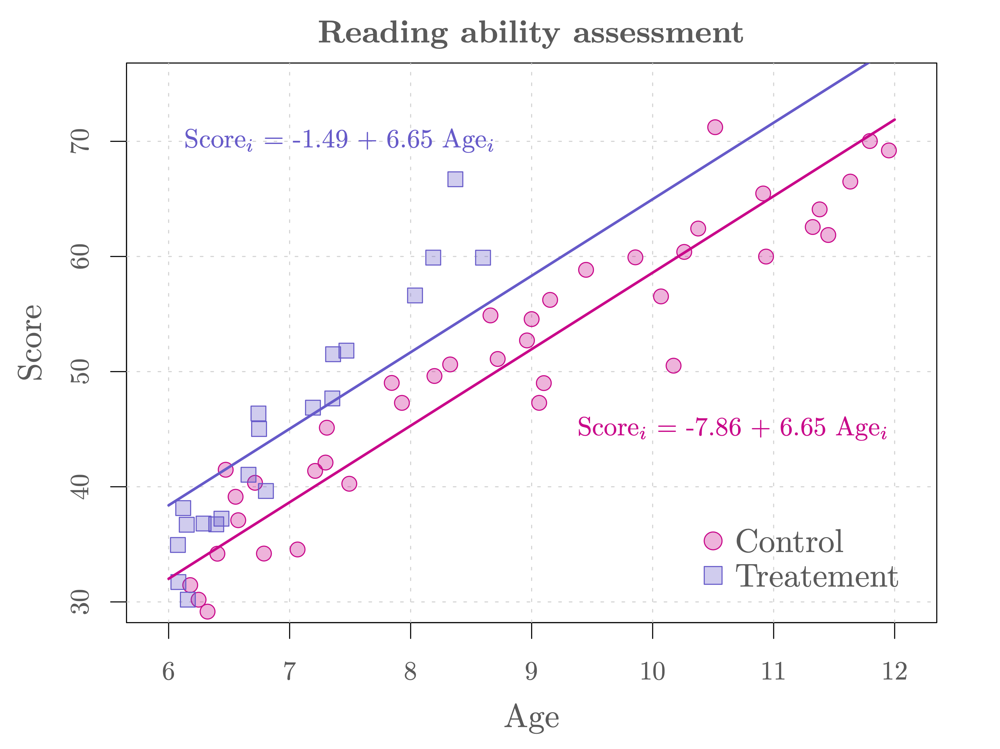
```

---

# .smaller[Could we use the] $R^2$.smaller[?]

- The .pink[coefficient of determination], denoted as $R^2$ and often referred to as R-squared, corresponds to the proportion of the variance in the response variable that is "explained" by the model.  
- $\color{#6A5ACD}{R^2}$ .purple[gives certain information about the goodness of fit of a model.] It measures how well the regression predictions approximate the real data points. An $R^2$ of 1 indicates that the regression predictions perfectly fit the data.
-  However, the value of $R^2$ is .pink[not related to the adequacy of our model to the data].
- ⚠️ Moreover, adding new covariates to the current model .purple[always] increases $R^2$, whether the additional covariates are significant or not. Therefore, $R^2$ alone cannot be used as a meaningful comparison of models with different covariates.
- The .pink[adjusted] $\color{#e64173}{R^2}$ is a modification of $R^2$ that aims to limit this issue. 

---

# .smaller[Rexthor, the Dog-Bearer!]

```{R, rsquare, out.width = "90%", echo = F}
include_graphics("pics/linear_regression.png")
```

👋 .smallest[If you want to know more have a look [here](https://www.explainxkcd.com/wiki/index.php/1725:_Linear_Regression).]

---

# .smaller[Model diagnostic]

```{R, diagmod1, out.width = "90%", echo = F}
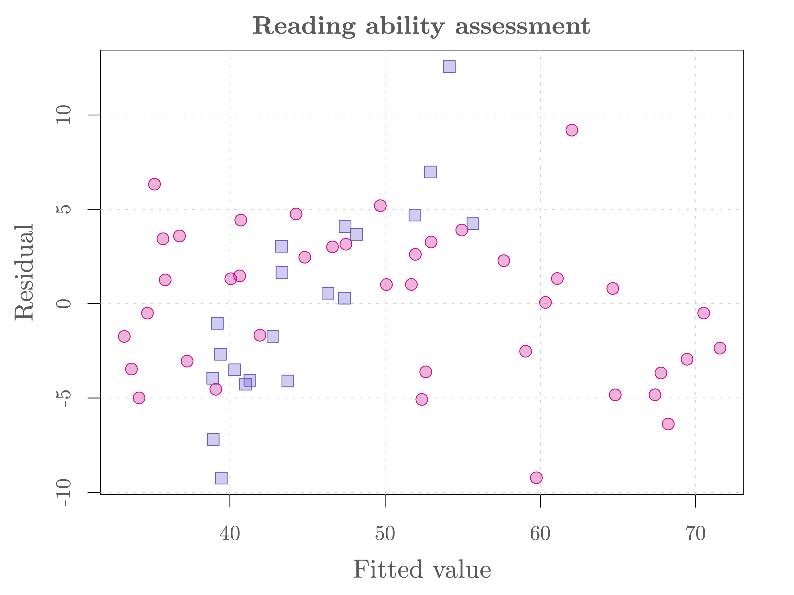
```

---

# .smaller[Model diagnostic] ⚠️

```{R, diag_mod1_v2, out.width = "90%", echo = F}
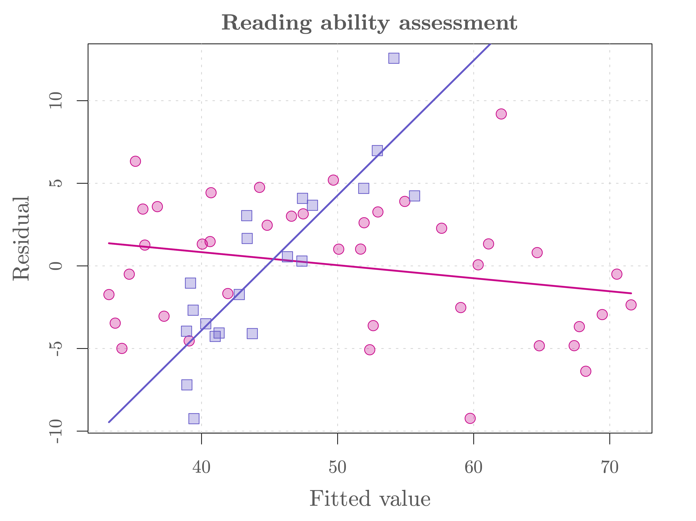
```

---

# .smaller[Model diagnostic] ⚠️

```{R, diag2_mod1, out.width = "90%", echo = F}
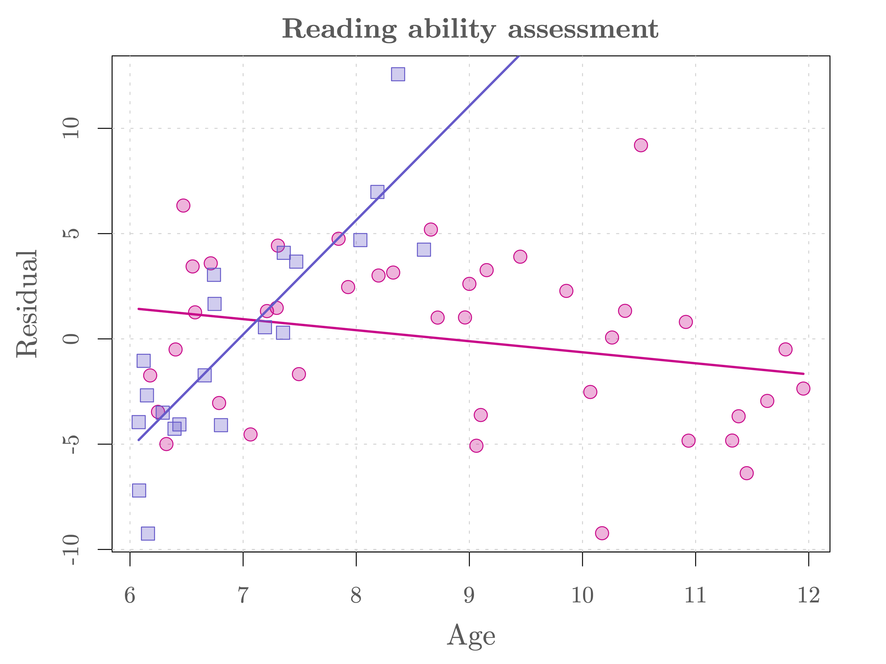
```

---

# .smaller[Model diagnostic]

```{R, qqplot_mod1, out.width = "90%", echo = F}
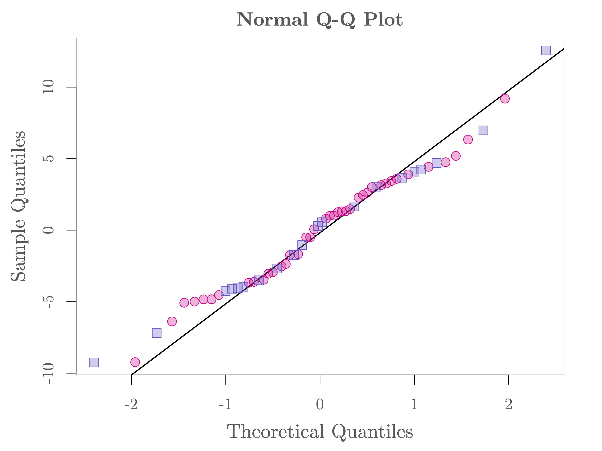
```

---

# .smaller[Let's update our model]

Our results suggest that the students of the group participating in these new directed reading activities progress more rapidly (which is actually more reasonable than our initial model 🤔). Therefore, we modify our model by adding an interaction term:

$$\color{#e64173}{\text{Score}_i} = \beta_0 + \beta_1 \color{#6A5ACD}{\text{Group}_i} + \beta_2 \color{#20B2AA}{\text{Age}_i} + \beta_3 \color{#6A5ACD}{\text{Group}_i}\color{#20B2AA}{\text{Age}_i} + \epsilon_i, \quad \epsilon_i \overset{iid}{\sim} \mathcal{N}(0, \sigma^2).$$
- $\color{#e64173}{\text{Score}_i}$: score of the DRP test of the $i$-th student.
- $\color{#6A5ACD}{\text{Group}_i}$: indicator of participation of the new directed reading activities for the $i$-th student (i.e. $\color{#6A5ACD}{\text{Group}_i} = 1$ if participate and $\color{#6A5ACD}{\text{Group}_i} = 0$ if not participate).
- $\color{#20B2AA}{\text{Age}_i}$: age of the $i$-th student (related to *.turquoise[time since start of treatment]*),

The goal of the educator is now to assess if $\beta_1$ and/or $\beta_3$ are .pink[significantly larger than 0].

---

# .smaller[Example: Reading ability assessment]

.panelset[
.panel[.panel-name[R Code]

Here is the code to fit our second model:

```{r, eval = F}
# Import data (if you haven't already)
dat = read.csv("data/reading.csv")

# Fit linear regression model
mod2 = lm(score ~ group*age, data = dat)
summary(mod2)
```

]
.panel[.panel-name[Output]
```{r, echo = F}
# Import data (if you haven't already)
dat = read.csv("data/reading.csv")

# fit a linear regression model
mod2 = lm(score ~ group*age, data = dat)
summary(mod2)
```
]
]

---

# .smaller[Interpretation of coefficients]

We can obtain the estimated coefficients. Specifically,
- $\hat{\beta}_0 = -3.2489$ represents the estimated baseline average score of the DRP test at birth (but *again* what does it mean? 🙄)
- $\hat{\beta}_1 = -36.0307$ means that .pink[for a student of the same age], participating in the new directed reading activities is estimated to decrease their average score of the DRP test by 36.0307 (does this make sense? 🧐).
- $\hat{\beta}_2 = 6.1207$ means that for students not participating to the new directed reading activities, their average score increases by 6.1207 as they become 1 year older.
- $\hat{\beta}_3 = 5.9539$ means that the average score of students participating in the new directed reading activities increases by 5.9539 as they become 1 year older .pink[compared to the other students]. This means that the average score of students participating to the new program increases by 12.0746 (i.e. 6.1207 + 5.9539) as they become 1 year older.

---

# .smaller[Model fit]

```{R, pointswithmod2, out.width = "90%", echo = F}
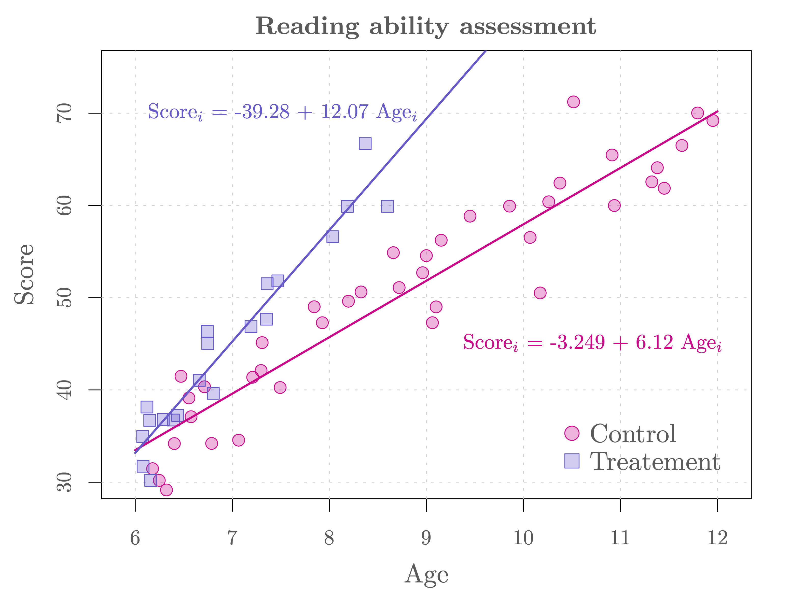
```

---

# .smaller[Model diagnostic]

```{R, diag_mod2_v2, out.width = "90%", echo = F}
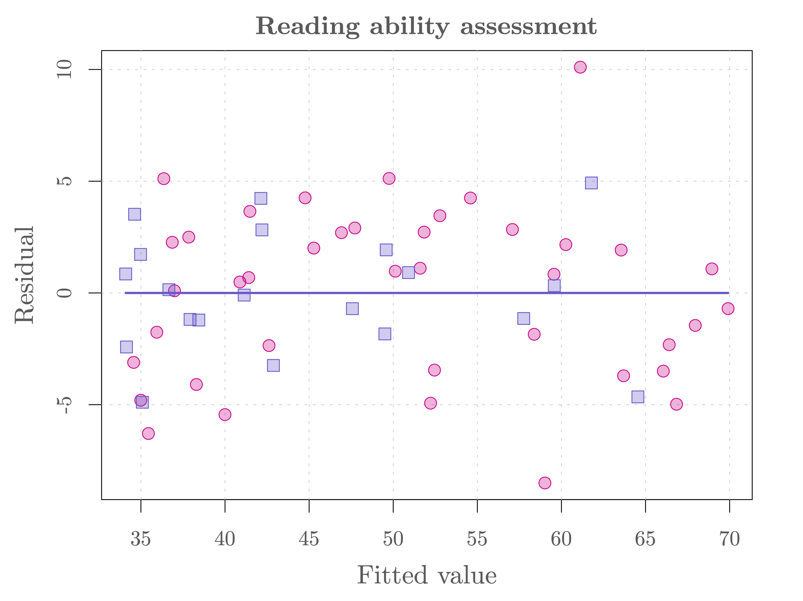
```

---

# .smaller[Model diagnostic]

```{R, diag2_mod2, out.width = "90%", echo = F}
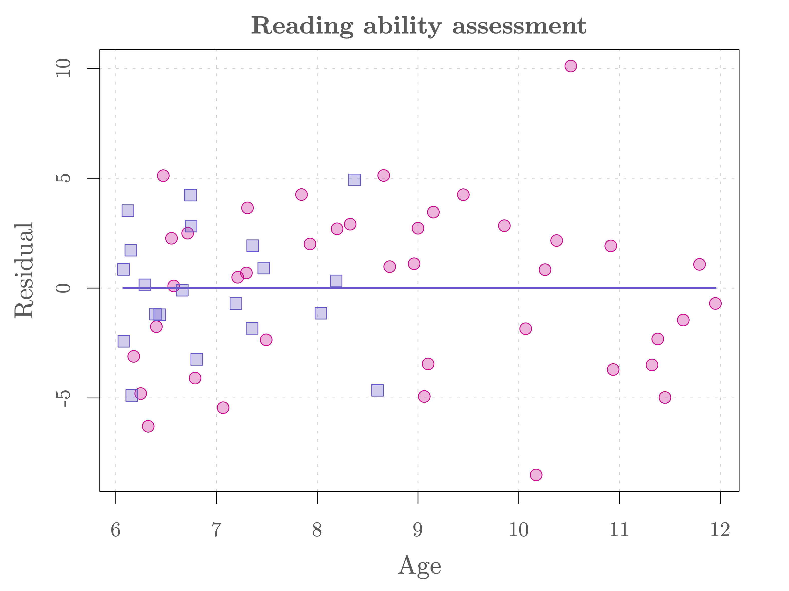
```

---

# .smaller[Model diagnostic]

```{R, qqplot_mod2, out.width = "90%", echo = F}
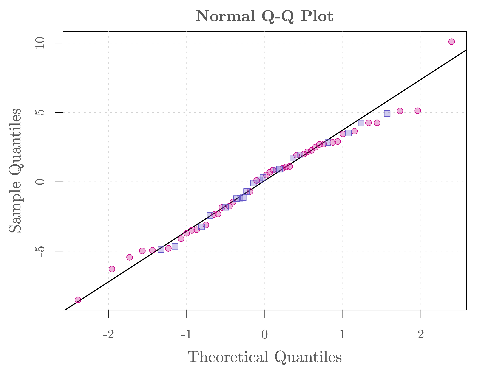
```

---

# .smaller[Model selection]

In general, we prefer a .pink[parsimonious approach to modeling] in the sense that we only choose a more complex model if the benefits are ".pink[substantial]"<sup>.smallest[👋]</sup>. We want our model to be such that:

1.  The model fits the data well.
2.  Avoid (excessive) overfitting.

Naturally these two objectives are .pink[contradictory] and there are many ways to select a suitable model (actually this is one of the most active areas of research in modern Statistics). In this class, we will only consider one (simple) approach based on the .pink[Akaike Information Criterion (AIC)]. This criterion corresponds to an .purple2[estimator of prediction error] and thereby .purple2[relative quality of statistical models for a given set of data].

.footnote[.smallest[👋  This point of view is based on .pink[Occam's razor] (or law of parsimony), the problem-solving principle stipulating that ".purple2[the simplest explanation is usually the right one]".]]

---

# .smaller[Model selection]

In `R`, the AIC can be computed for a given model (i.e. use the output of the function `lm(...)` in `AIC(model)`.) For example, we can compare the AIC of the previously considered models as follows:

```{r}
AIC(mod1)     # First model (no interaction)
AIC(mod2)     # Second model (with interaction)
```

As expected, these results suggest that the second model is more appropriate. .pink[But should we further improve it?]

---

# .smaller[Let's update our model (again)]

It should be reasonable that the average reading scores of the two groups are the same at the start of the program.

$$\color{#e64173}{\text{Score}_i} = \beta_0 + \beta_1 \color{#20B2AA}{(\text{Age}_i - 6)}  + \beta_2 \color{#6A5ACD}{\text{Group}_i}\color{#20B2AA}{(\text{Age}_i - 6)} + \epsilon_i, \quad \epsilon_i \overset{iid}{\sim} \mathcal{N}(0, \sigma^2).$$
- $\color{#e64173}{\text{Score}_i}$: score of the DRP test of the $i$-th student.
- $\color{#6A5ACD}{\text{Group}_i}$: indicator of participation of the new directed reading activities for the $i$-th student (i.e. $\color{#6A5ACD}{\text{Group}_i} = 1$ if participate and $\color{#6A5ACD}{\text{Group}_i} = 0$ if not participate).
- $\color{#20B2AA}{\text{Age}_i - 6}$: corresponds to the time since start of treatment of the $i$-th student. 

With this model the two groups can be compared as the age effect is taken into account. The goal of the educator now is (.pink[only!]) to assess if $\beta_1$ is .pink[significantly larger than 0].

---

# .smaller[Example: Reading ability assessment]

.panelset[
.panel[.panel-name[R Code]

Here is the code to fit our third model:

```{r, eval = F}
# Import data (if you haven't already)
dat = read.csv("data/reading.csv")
dat$age_minus_6 = dat$age - 6

# Fit linear regression model
mod3 = lm(score ~ age_minus_6 + group:age_minus_6, data = dat)
summary(mod3)
```

]
.panel[.panel-name[Output]
```{r, echo = F}
# Import data (if you haven't already)
dat = read.csv("data/reading.csv")
dat$age_minus_6 = dat$age - 6

# Fit linear regression model
mod3 = lm(score ~ age_minus_6 + group:age_minus_6, data = dat)
summary(mod3)
```
]
.panel[.panel-name[AIC]
```{r}
AIC(mod1)
AIC(mod2)
AIC(mod3)
```
]
]

---

# .smaller[Model fit]

```{R, pointswithmod3, out.width = "90%", echo = F}
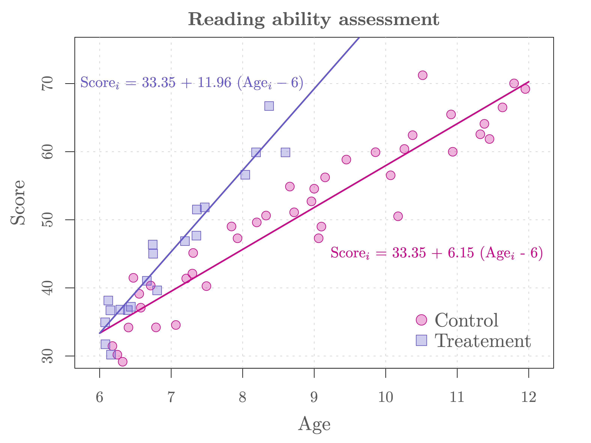
```

---

# .smaller[Model diagnostic]

```{R, diag_mod3_v2, out.width = "90%", echo = F}
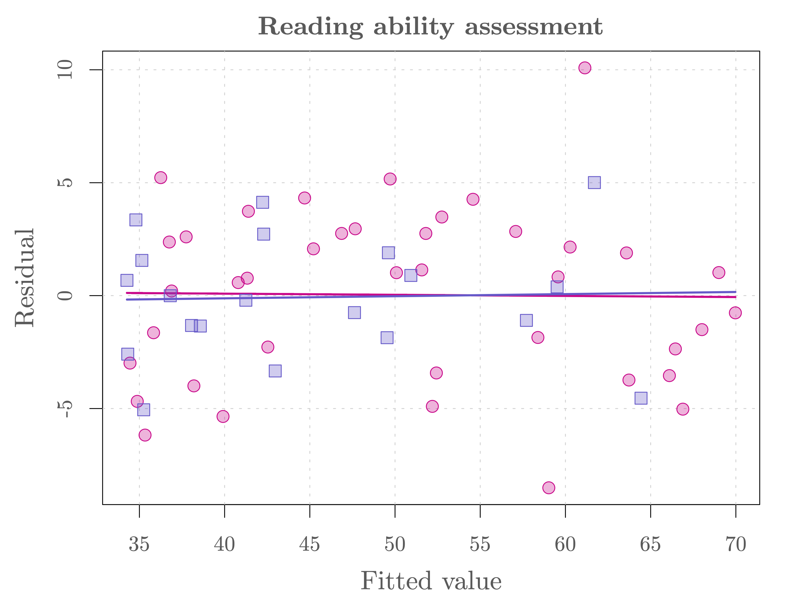
```

---

# .smaller[Model diagnostic]

```{R, diag2_mod3, out.width = "90%", echo = F}
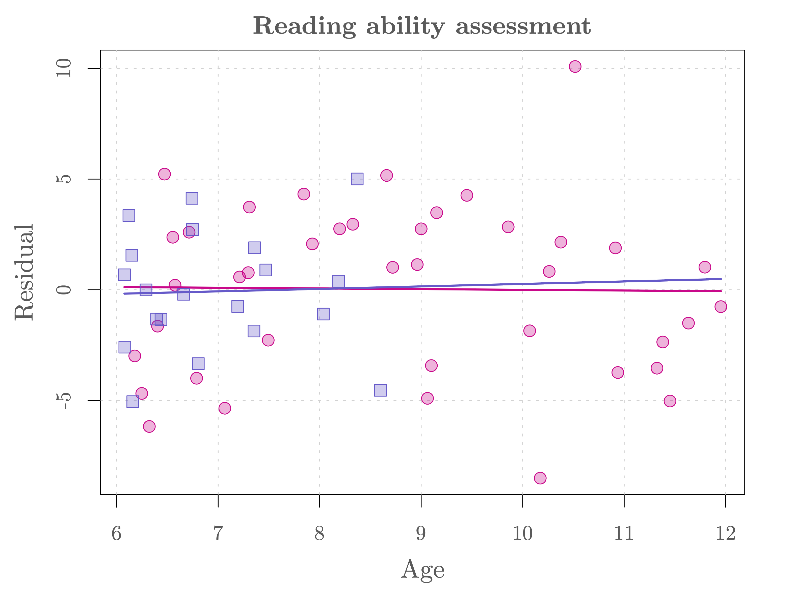
```

---

# .smaller[Model diagnostic]

```{R, qqplot_mod3, out.width = "90%", echo = F}
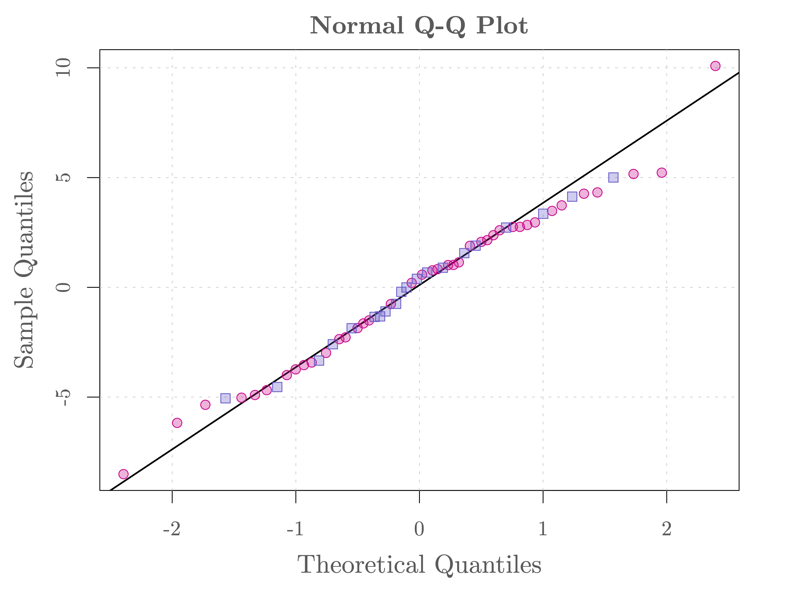
```

---

# .smaller[Concluding remarks]

- The last model we consider appears to fit the data, avoids overfitting and allows to answer whether the new reading activities are of interest. Indeed, the programs significantly improve the reading performance of the students (e.g. 5.81 more per year compared to control, p-value < 5%).
- Our model .pink[assumes a linear relationship] between the response and the covariates. However, this may be incorrect.
- Our model .pink[only considers independent data] (which may not be correct here).
- Finally, linear regression .pink[should not be used to extrapolate], i.e. to estimate beyond the original observation range. For example, if we consider a 100 year-old person in this reading ability example, we would predict (using the third model) that the corresponding score of the DRP test would be 1157.59 and 611.45, respectively, with and without these activities. Does it really make sense? 😯

---

# .smaller[Extrapolating]

```{R, out.width = "90%", echo = F}
include_graphics("pics/extrapolating.png")
```

👋 .smallest[If you want to know more have a look [here](https://www.explainxkcd.com/wiki/index.php/605:_Extrapolating).]

---

# .smaller[Exercise: Crime Rate]

.panelset[
.panel[.panel-name[Problem]
A police governor is interested in studying the effects of various variables by the US states on the .hi-pink[crime rate]. To study this issue, 47 crime rate data were collected, together with the following variables: `Youth` (number of males aged 18-24 per 1k), `Southern` (southern state, 1=yes, 0=no), `Education` (education time), `Expenditure` (expenditure on police), `LabourForce` (number of young men employed per 1k), `Males` (number of males per 1k females), `StateSize` (state size in hundred thousands), `HighYouthUnemploy` (1=yes, 0=no), `Wage` (median weekly wage), and `BelowWage` (number of families below half wage per 1k). .pink[Based on this data, can you find a suitable model to predict the crime rate?]
]
.panel[.panel-name[Import]
```{r}
# Import data
crime = read.csv("data/crime.csv", row.names=1)
head(crime)
```
]
]

---

# .smaller[Exercise: Crime Rate]

.panelset[
.panel[.panel-name[Full]
We start by fitting an initial model with all covariates included (without interactions):

```{r, results = FALSE}
fit.full = lm(CrimeRate ~ ., data = crime)
summary(fit.full)
```

We can see that some variables appear not significant, implying that we may be able to find a smaller model with less variables.
]
.panel[.panel-name[Back]
We can use the `step()` function to perform stepwise model selection using the AIC by removing variables iteratively from our full model. This approach is known as .hi-pink[stepwise backward AIC] and it is an heuristic method which avoids to explore ALL models.

```{r, eval = F}
fit.aic.backward = step(fit.full, trace = F)
summary(fit.aic.backward)
```
]
.panel[.panel-name[Back]
```{r, echo = F}
fit.aic.backward = step(fit.full, trace = F)
summary(fit.aic.backward)
```
]
.panel[.panel-name[For]
It is also possible to consider .hi-pink[a forward approach] starting from a simple model.
```{r, eval = F}
fit.initial = lm(CrimeRate ~ 1, data = crime)
fit.aic.forward = step(fit.initial, 
                           scope = list(lower = formula(fit.initial),
                                        upper = formula(fit.full)), 
                           direction = "forward", trace = FALSE)
summary(fit.aic.forward)
```
]
.panel[.panel-name[For]
```{r, echo = F}
fit.initial = lm(CrimeRate ~ 1, data = crime)
fit.aic.forward = step(fit.initial, 
                           scope = list(lower = formula(fit.initial),
                                        upper = formula(fit.full)), 
                           direction = "forward", trace = FALSE)
summary(fit.aic.forward)
```
]
.panel[.panel-name[Comp]
```{r}
AIC(fit.full)
AIC(fit.aic.backward)
AIC(fit.aic.forward)
```

In this case, the two methods (i.e. forward and backward) appear to be equivalent.
]
.panel[.panel-name[Check]
```{r, echo = F, message=F, warning=F, results=F}
library(gamlss)
fit.gamlss = gamlss(formula(fit.aic.forward), data = crime)
```
```{r, out.width = "85%", echo = F}
plot(fit.gamlss)
```
]
]